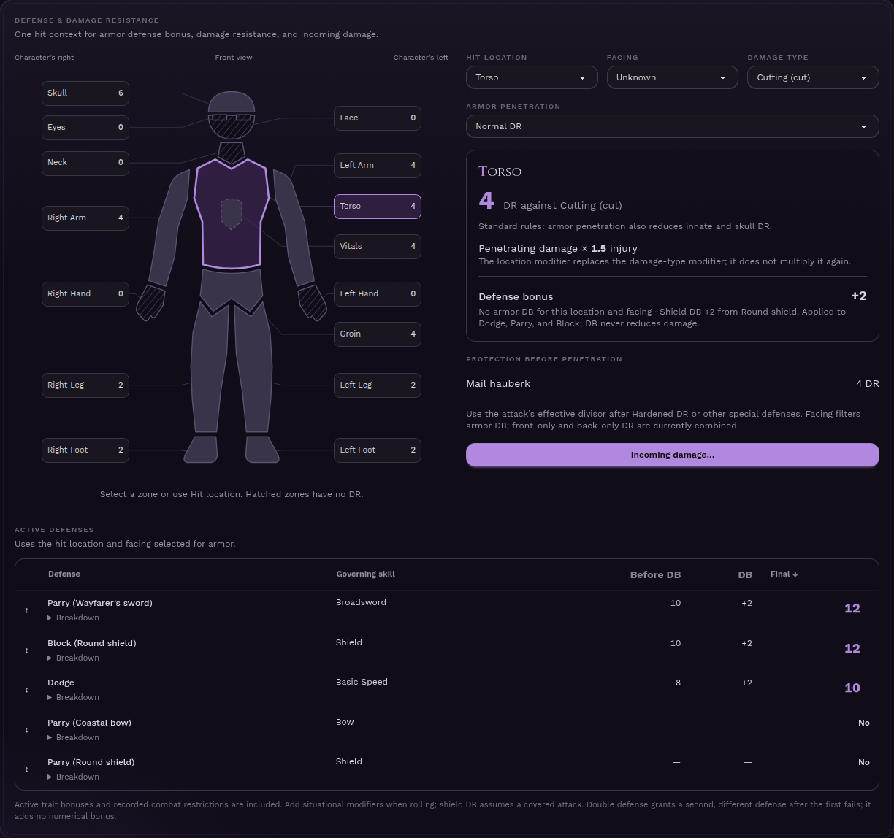
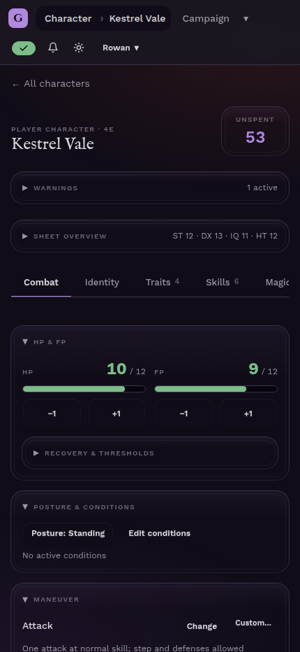
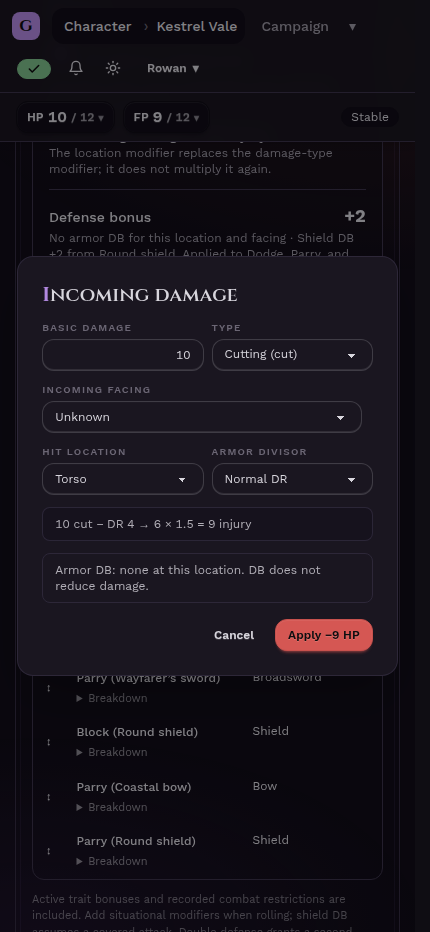
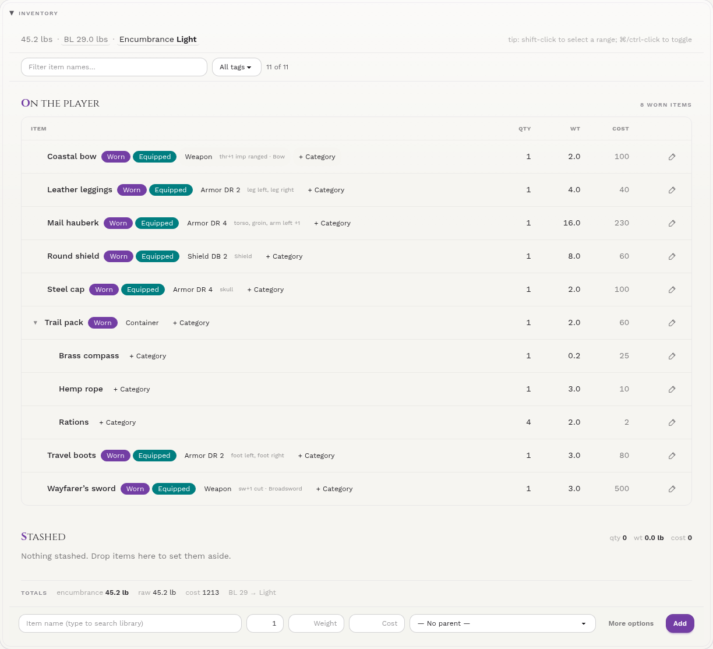
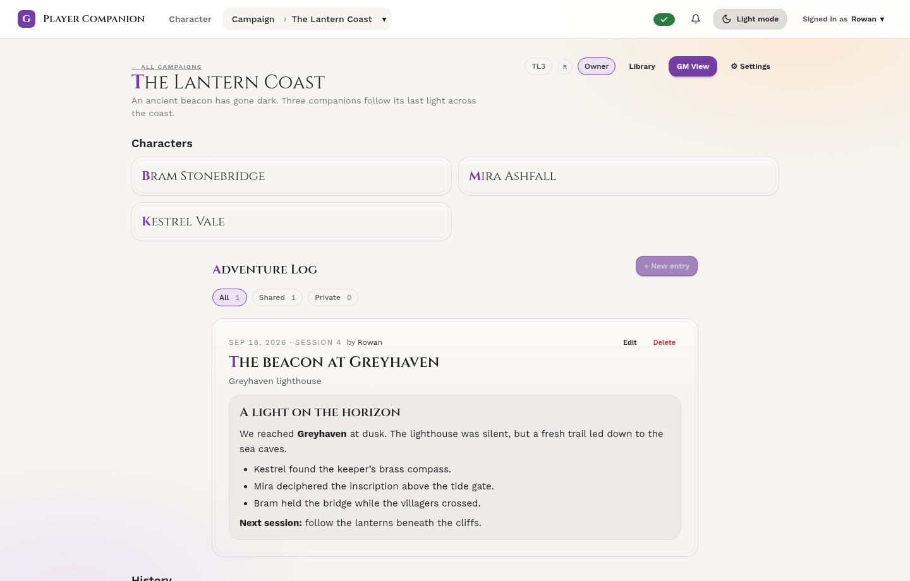

# GURPS Player Companion

**Your character sheet, combat companion, and campaign notebook — at the table or on the go.**

Keep your GURPS 4e characters ready for the next session. Roll attacks, see where your armor protects you, track spells and equipment, and share a campaign with your group. Use it on a phone, tablet, or desktop, with light and dark themes and an installable app that keeps character edits available offline.

**[Play on the official hosted instance → gurps.abundant.zip](https://gurps.abundant.zip)**



*Choose a hit location on the armor diagram to see its protection, defense bonuses, and incoming-damage options.*

## Keep the game moving

- **Combat at your fingertips.** Adjust HP and FP, choose maneuvers, record posture and conditions, and roll weapon attacks, damage, Dodge, Parry, or Block from the same sheet.
- **See what stops a hit.** Explore graphical armor coverage by location and damage type, including innate protection and enchantments. The incoming-damage helper previews penetration, wounding modifiers, and injury before you apply HP loss.
- **Roll with context.** Tap skill and spell levels to open the roller, add situational modifiers, and use hit-location or ranged-attack presets. Revisit recent rolls in the character’s device-local roll history.
- **Keep temporary bonuses separate.** Record temporary modifiers without changing permanent attributes or character points.

| Combat on your phone | Resolve incoming damage |
| --- | --- |
|  |  |

## A character sheet that does the bookkeeping

Build out attributes, advantages, disadvantages, quirks, skills, techniques, languages, and spells. Derived stats, skill levels, a live point ledger, and campaign-limit warnings help you keep the numbers straight.

- **Skills with room for your campaign.** Specializations, defaults, prerequisites, contextual modifiers, and authored skill actions keep the relevant rules beside the roll.
- **Magic with resources attached.** Track spell costs and maintenance, allocate casting energy, and manage powerstones and magic items.
- **Equipment that matters.** Organize nested containers with drag-and-drop, filter your pack, and track weight, cost, encumbrance, weapon modes, armor, and mechanical enchantments.
- **Notes and a change history.** Keep character notes in a rich text or Markdown editor and review saved changes in the History tab.



## Bring your campaign together

Invite your players, set campaign point limits, tech level, mana, and house rules, and decide who can see full character sheets. GMs and managers get a party dashboard for checking characters during play; optional GM editing lets them help with player sheets.

Build a shared library of traits, skills, spells, items, enchantments, and active effects. Portable YAML import/export lets you reuse campaign content, including languages, techniques, and styles. Record adventures with formatted session notes, locations, XP awards, and campaign-wide or private visibility.



An **experimental turn tracker**, enabled in campaign settings, adds PC/NPC turn order and timed effects. A character also gets a personal initiative scratchpad when that setting is enabled.

## Keep playing when the connection drops

Once you have signed in and synced your characters, character-sheet edits save on your device first and sync when the connection returns. That includes traits, skills, spells, languages, techniques, inventory, and combat state. The sync indicator shows pending work and explains problems when a change needs attention.

Install the app from your browser for quick access. Campaign administration, library editing, adventure logs, invitations, and the shared encounter tracker require an internet connection.

## Connect your assistant

Connect a compatible MCP assistant to **`https://gurps.abundant.zip/mcp`** to work with your characters and campaigns. Approve its read, write, or management permissions through your account, and revoke access at any time in **Settings → Connected apps**. See the [MCP guide](docs/specs/mcp-agent-access.md) for client and protocol details.

*Screenshots use fictional demo characters and campaign content from the current app. [Capture details](docs/screenshots/README.md).*

---

## Set up and run your own instance

You only need **Docker with Docker Compose** on the host. Bun and PostgreSQL 18 run in containers.

### Local development

```sh
git clone https://github.com/capeterson/gurps-player-companion.git
cd gurps-player-companion
docker compose -f docker-compose.dev.yml up --build
```

Open **[http://localhost:3001](http://localhost:3001)** and create an account. The development Compose file supplies development credentials, installs dependencies in a shared volume, applies migrations, and starts the app with hot reload. No `.env` is required for this path.

| Service | Local address / behavior |
| --- | --- |
| App and API | `http://localhost:3001`; container port `3000`. |
| PostgreSQL 18 | `localhost:5434`; database/user/password are `gurps`; container port `5432`. |
| Migrations | One-shot `migrate` service; the app waits for it to succeed. |

The development Compose project is named `nimble-rocket-29ef18d6`. Its `db_data_dev` volume persists the database, and `bun_modules` holds dependencies.

Useful commands:

```sh
# Seed Sample plus The Lantern Coast and its three playable demo characters.
docker compose -f docker-compose.dev.yml run --rm migrate bun run db:seed

# Follow app logs.
docker compose -f docker-compose.dev.yml logs -f app

# Open a database shell.
docker compose -f docker-compose.dev.yml exec db psql -U gurps gurps

# Stop the stack and keep its data.
docker compose -f docker-compose.dev.yml down
```

The optional seed includes **Kestrel Vale, Mira Ashfall, and Bram Stonebridge** with linked libraries, equipment, magic, active effects, session logs, and an encounter. See the [seed guide](bootstrap/README.md) for demo account credentials, scenario coverage, and repeat-run behavior. Adding `-v` to `down` deletes the development database and dependency volumes.

### Production / self-hosting

Copy the environment example, generate a signing key, and edit `.env`:

```sh
cp .env.example .env
openssl rand -hex 32
```

Replace `JWT_SECRET` with the generated value. Set `APP_BASE_URL` to **your own public HTTPS origin**, such as `https://gurps.example.com`, with no path or query. The official hosted instance is `https://gurps.abundant.zip`; a separate deployment should use its own address.

```sh
docker compose -f docker-compose.yml up --build -d
curl -fsS http://localhost:3000/api/v1/healthz
# {"ok":true}
```

Production exposes **port 3000**. The stack builds the app, applies migrations, and starts only after they succeed. Put it behind an HTTPS reverse proxy pointing at port 3000; forward WebSocket upgrades and leave `/api/*`, `/mcp`, `/oauth/*`, and `/.well-known/*` uncached. Keep the `db_data` volume backed up. To update, pull the latest code and rerun the build/start command.

The supplied Compose files set container variables explicitly: `.env` supplies `${...}` substitutions, **not every container setting automatically**. For options not forwarded in the file, add them to the app service’s `environment` in a Compose override and include that override with `-f`. The production file forwards `JWT_SECRET`, `APP_BASE_URL`, `OAUTH_CLIENTS`, `TRUST_PROXY`, and the `AUTH_RATE_LIMIT_*` settings; database credentials, ports, token lifetimes, and CORS are fixed in that file unless overridden.

### Environment variables

[`.env.example`](.env.example) is the starting template; [server configuration](src/server/config.ts) validates the following runtime settings.

| Variable | Default / requirement | Purpose |
| --- | --- | --- |
| `ENVIRONMENT` | `development` | `development`, `test`, or `production`. Production disables the API docs UI and live OpenAPI endpoint. Production Compose sets this to `production`. |
| `HOST` | `0.0.0.0` | Server bind address. |
| `PORT` | `3000` | Port inside the container; change Compose port mappings separately. |
| `DATABASE_URL` | Required | PostgreSQL 18 connection URL. Compose uses `postgres://gurps:gurps@db:5432/gurps`; host tools for the dev database use `localhost:5434`. |
| `JWT_SECRET` | Required; at least 32 characters | Signing secret; placeholders are rejected. Generate with `openssl rand -hex 32`. |
| `JWT_ACCESS_TTL_MINUTES` | `15` | Access-token lifetime in minutes. |
| `JWT_REFRESH_TTL_DAYS` | `14` | Refresh-token lifetime in days. |
| `API_KEY_PEPPER` | Falls back to `JWT_SECRET` | Optional independent API-key HMAC secret, at least 16 characters. |
| `APP_BASE_URL` | Required in production | Canonical public origin for OAuth and emailed links. Production requires HTTPS; dev Compose sets `http://localhost:3001`. |
| `CORS_ORIGINS` | `[]` | JSON array of allowed origins. Empty means same-origin only; both Compose files set `[]`. |
| `RESEND_API_KEY` | Unset | Enables Resend delivery for password resets and campaign invitations. |
| `RESEND_FROM_EMAIL` | Unset | Sender email for Resend; configure alongside the API key. |
| `OAUTH_CLIENTS` | `[]` | Optional JSON array of operator-defined public OAuth clients. Supported clients can register/discover themselves without an entry. See `.env.example` for the shape. |
| `TRUST_PROXY` | `false` | Trust forwarded client IPs only behind a proxy that overwrites `X-Forwarded-For`. |
| `AUTH_RATE_LIMIT_WINDOW_SECONDS` | `600` | Shared public-auth rate-limit window in seconds, from 1 to 86,400. |
| `AUTH_RATE_LIMIT_LOGIN_MAX` | `10` | Login-attempt limit per window. |
| `AUTH_RATE_LIMIT_REGISTER_MAX` | `5` | Registration-attempt limit per window. |
| `AUTH_RATE_LIMIT_RESET_MAX` | `3` | Password-recovery attempt limit per window. |
| `AUTH_RATE_LIMIT_CHALLENGE_MAX` | `10` | Passkey-challenge attempt limit per window. |

Development HMR uses `VITE_HMR_HOST` (default `localhost`), `VITE_HMR_PORT` (default `3000`, set to `3001` by dev Compose), and `VITE_HMR_PROTOCOL` (`ws`, or `wss` for TLS). These control the browser’s hot-reload connection, not the public application URL. Test-runner overrides are documented in [playwright.config.ts](playwright.config.ts).

### Development checks and further reading

```sh
docker compose -f docker-compose.dev.yml exec app bun run check
docker compose -f docker-compose.dev.yml exec app bun run test:client
```

The first command runs lint, type checking, server/shared tests, and API/MCP contract checks. Browser tests use Playwright against the running dev app; see [playwright.config.ts](playwright.config.ts).

Start with the [application overview](docs/specs/overview.md) and [contribution rules](AGENTS.md) before changing code. Detailed implementation notes live in the [architecture](docs/specs/architecture.md), [offline sync](docs/specs/offline-sync.md), [campaign sharing](docs/specs/campaign-content-sharing.md), and [history](docs/specs/history-tracking.md) guides.
